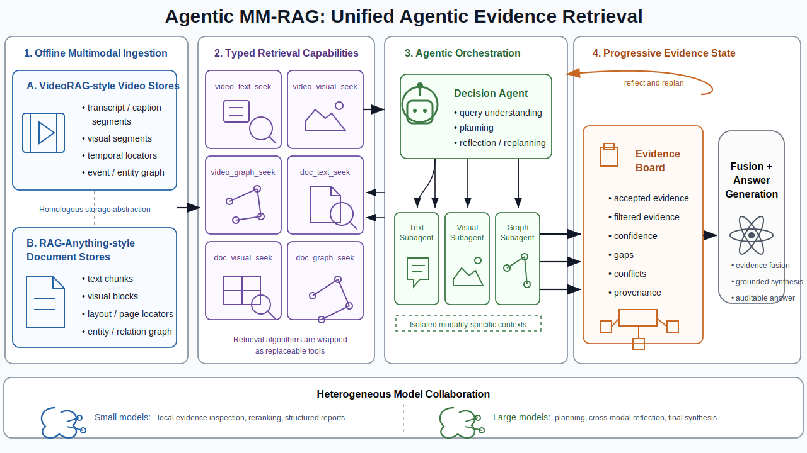

# Agentic MM-RAG

Agentic MM-RAG is a storage-native runtime for agentic multimodal evidence
retrieval. It reads processed document and video RAG stores, exposes typed
retrieval tools, runs constrained specialist agents, and generates answers from
filtered evidence with explicit gap and audit context.

The project separates offline ingestion from online reasoning. Heavy parsers,
OCR, ASR, video encoders, and graph builders prepare stores ahead of time; the
runtime focuses on retrieval, routing, evidence review, reflection, fusion, and
grounded synthesis.



## Highlights

- **Unified document + video retrieval** over RAG-Anything-style document
  stores and VideoRAG-style video stores.
- **Typed retrieval tools** for text, visual, and graph evidence instead of one
  overloaded retriever.
- **Constrained specialist agents** that only receive the tools they need.
- **Structured evidence state** through an evidence board and refreshable
  evidence pool.
- **Deterministic guardrails** for relevance checks, gap detection, conflict
  hints, and evidence fusion.
  
## How It Works

The online query flow is:

1. The caller provides a `QueryContext` with query text and retrieval vectors.
2. The system rewrites the query into text, visual, graph, and expanded forms.
3. A rule-based planner creates typed retrieval tasks.
4. Text, visual, and graph subagents run constrained tool-calling sessions.
5. Each subagent retrieves evidence and writes a structured report.
6. The evidence board records reports, facts, gaps, and coverage.
7. A deterministic audit checks relevance, missing terms, modality coverage,
   and possible conflicts.
8. The planner may launch follow-up retrieval tasks.
9. Evidence from current reports is fused; optional evidence-pool reuse can be
   enabled explicitly for interactive refresh workflows.
10. The final model receives filtered evidence, gap context, and audit context
    to produce a grounded answer.

Planning and reflection are intentionally inspectable: the current planner is
implemented as Python routing logic, not free-form LLM planning. Models are used
for query rewriting, subagent tool use, optional visual inspection, and final
synthesis.

## Public Tool Surface

| Tool | Purpose |
| --- | --- |
| `doc_text_seek` | Retrieve document text chunks and linked multimodal chunks. |
| `doc_visual_seek` | Retrieve document images, charts, tables, visual blocks, and nearby page context. |
| `doc_graph_seek` | Retrieve document entity/relation graph evidence and supporting chunks. |
| `video_text_seek` | Retrieve video transcript, caption, OCR, and mapped segment text. |
| `video_visual_seek` | Retrieve video segments using visual vectors and segment context. |
| `video_graph_seek` | Retrieve video graph entities and map them back to segments. |
| `read_evidence` | Read the shared evidence board. |
| `write_evidence` | Write a structured subagent evidence report. |

Subagents receive curated tool profiles. For example, `doc_text_subagent` gets
`doc_text_seek` and `write_evidence`; the decision-agent profile gets
`read_evidence`.

## Core Modules

| Path | Role |
| --- | --- |
| `api.py` | Public `AgenticMMRAG` and session constructors. |
| `runtime.py` | Lightweight runtime facade for tool manifests, registries, corpora, and backends. |
| `agent/` | Planner, subagents, model runner, prompts, and evidence quality checks. |
| `orchestrator/` | End-to-end workflow, evidence board, evidence pool, and evidence I/O tools. |
| `tools/` | Public tools, JSON schemas, registry, metadata, and tool loading. |
| `tools/runtime/` | Retrieval backends, evidence construction, scoring, graph/vector/doc/video store adapters. |
| `providers/` | LLM provider protocol and OpenAI-compatible adapter. |
| `data/` | Optional ingestion scripts and expected storage layout documentation. |

## Installation

Core runtime:

```bash
python -m pip install -e .
```

OpenAI-compatible provider:

```bash
python -m pip install -e ".[openai]"
export OPENAI_API_KEY=...
```

Development:

```bash
python -m pip install -e ".[dev]"
python -m pytest
```

## Quick Start

```python
from agentic_mm_rag import AgenticMMRAG, QueryContext
from agentic_mm_rag.providers.openai_compat import OpenAIChatProvider

provider = OpenAIChatProvider()
app = AgenticMMRAG.from_defaults(provider=provider)

result = await app.run(
    QueryContext(
        query_text="What evidence supports the claim?",
        doc_query_vector=[0.0, 0.1, 0.2],
        video_query_vector=[0.0, 0.1, 0.2],
        visual_query_vector=[0.0, 0.1, 0.2],
        top_k=8,
    )
)

print(result.answer)
```

You can also use the runtime without the orchestrator:

```python
from agentic_mm_rag import create_runtime

runtime = create_runtime()
print(runtime.tool_manifest())
print(runtime.tool_manifest("video_visual_subagent"))
```

`QueryContext` expects embedding vectors from the caller. The package includes a
minimal OpenAI-compatible embedding client, but the orchestrator does not
automatically embed queries.

## Processed Store Paths

By default, the runtime reads processed corpora from:

| Variable | Default |
| --- | --- |
| `AGENTIC_MM_RAG_DOC_ROOT` | `data/doc_rag` |
| `AGENTIC_MM_RAG_VIDEO_ROOT` | `data/video_rag` |
| `AGENTIC_MM_RAG_DOC_VISUAL_ASSET_ROOTS` | empty |

See `data/README.md` for ingestion commands and expected RAG-Anything /
VideoRAG storage layouts.

## Model Configuration

Model roles are configured for the decision agent and the three expert
subagent types:

| Variable | Default | Used for |
| --- | --- | --- |
| `AGENTIC_MM_RAG_DECISION_MODEL` | `gpt-4o` | query rewriting, planning/reflection logic support, and final synthesis |
| `AGENTIC_MM_RAG_TEXT_MODEL` | `gpt-4o-mini` | document/video text subagents |
| `AGENTIC_MM_RAG_VISUAL_MODEL` | `gpt-4.1` | document/video visual subagents and source-image inspection |
| `AGENTIC_MM_RAG_GRAPH_MODEL` | `gpt-4o-mini` | document/video graph subagents |

The evidence pool is deterministic state and does not use a model. Cross-query
pool reuse is disabled by default to keep batch evaluation samples isolated; set
`reuse_evidence_pool=True` on the orchestrator only for interactive refresh
workflows. The evidence board is also heuristic by default; if optional LLM
consolidation is enabled, it reuses the decision model rather than introducing
another model role.

## Current Limitations

- **Data processing quality sets the retrieval ceiling.** If parsing, OCR,
  captioning, ASR, timestamping, entity extraction, or graph construction is
  weak, the online agent runtime cannot fully recover.
- **Model behavior still depends heavily on prompt quality.** Query rewriting,
  subagent tool use, evidence filtering, visual inspection, and final synthesis
  are all prompt-sensitive.
- Query vectors must currently be supplied by the caller.
- Ingestion dependencies are intentionally kept outside the lightweight runtime
  path and can be heavy.
- The planner is inspectable but heuristic, so routing quality depends on
  maintained rules and retrieval hints.

## Verification

```bash
python -m pytest
python -m py_compile $(find . -path './data/vendor' -prune -o -name '*.py' -print)
```

## Open-Source Status

The package is prepared under the MIT license. Upstream ingestion frameworks
such as RAG-Anything and VideoRAG are not vendored in this repository; install
them separately or point the ingestion scripts at local upstream checkouts.
